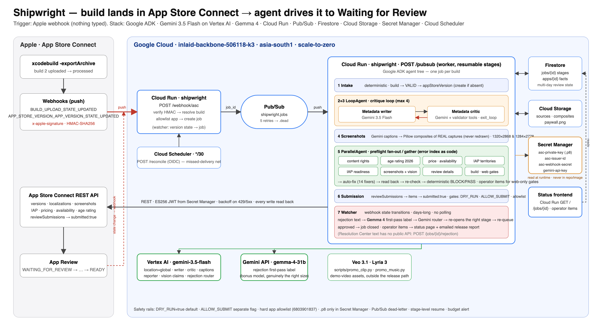

# Shipwright

**A build lands in App Store Connect. Nobody types anything. Hours later the app is Waiting for Review.**

Shipwright is an event-driven agent for the last mile of iOS shipping — the part between "the binary
uploaded" and "Apple is reviewing it". That mile is metadata, screenshots, 175-territory pricing,
availability, age-rating questionnaires, review notes, IAP readiness, and a dozen silent traps that only
surface *after* you press Submit. I have shipped 14 apps and the week before this hackathon I spent two
days doing that mile by hand for a new one. This agent does it unattended, and it knows every trap I
already paid for.

Built for the **All Things Agentic Hackathon (Google) — Taskmaster track**. Demo target: a real, brand-new
app record (`SnipStash`, id `6803901837`) on my real developer account.

> **Trigger is an Apple webhook, not a chat box.** `BUILD_UPLOAD_STATE_UPDATED` → HMAC-verified POST to
> Cloud Run → job. Review-state transitions arrive the same way days later. Cloud Scheduler reconciles
> every 30 min in case a delivery is missed. Zero polling loops, zero typing.



## What it does (the seven agents)

| # | Agent | Kind | Job |
|---|---|---|---|
| 1 | **Intake** | deterministic | Webhook → build → waits for `VALID` → finds/creates the `appStoreVersion` → Firestore job, Pub/Sub fan-out |
| 2 | **Metadata writer** | Gemini 3.5 Flash | Name / subtitle / keywords / description / promo text / App Review notes from operator-seeded app facts, under the three-name doctrine |
| 3 | **Metadata critic** | Gemini 3.5 Flash + tools | Separate agent whose only job is to *reject*: calls a deterministic validator (30/30/100 limits, fill ≥27/27/97, zero cross-field word repeats, no plurals, no "app", no brands, no hardcoded price) then applies judgment (3.1 accuracy, tone). Approves via `exit_loop`. **ADK `LoopAgent`, max 4 rounds.** |
| 4 | **Screenshot agent** | Gemini captions + Pillow | Composites **real device captures** onto branded backdrops with keyword-echoing captions. An image model never touches the UI (it hallucinates numbers). Renders 1320×2868 for the API slot and 1284×2778 for the web uploader. |
| 5 | **Compliance preflight** | **ADK `ParallelAgent`** fan-out / deterministic gather | 14 checks, each an error-index row encoded as an API read. Auto-fixes what the API can fix, reads state back, re-checks, emits a BLOCK/PASS verdict plus **operator items** for web-only gates. Includes a Gemini-vision pass over the captures that flags on-screen claims the app can't back. |
| 6 | **Submission** | deterministic, triple-gated | Attaches build, writes metadata, `reviewSubmissions → reviewSubmissionItems → PATCH submitted:true`, reads the state back. Requires `DRY_RUN=false` **and** `ALLOW_SUBMIT=true` **and** the app on the allowlist. |
| 7 | **Watcher** | webhook-driven + Gemma 4 + Gemini | Days-long, no polling: version-state webhooks update the job. On rejection, **Gemma 4** gives a cheap first-pass label, Gemini parses Apple's prose into a routing decision, the right stage re-opens and the job re-queues itself. |

LLM where judgment is needed, code where determinism is. Named patterns: **critique loop** (2↔3),
**parallel fan-out/gather** (5), **deterministic gate** (5→6), **resumable stage pipeline** (all),
**human-in-the-loop escalation** (operator items).

### What the first real run found on a real app record

Build 2 of SnipStash was uploaded at 19:35:55 UTC; Apple's webhook fired `PROCESSING → COMPLETE` at
19:37:25; the worker ran all stages unattended. Preflight on a fresh app record, before any fix:

```
[BLOCK] contentRightsDeclaration unset — surfaces only at reviewSubmissionItems POST
[BLOCK] version.copyright empty — hidden blocker at submit
[BLOCK] 2026 age-rating fields unanswered: advertising, parentalControls, lootBox, healthOrWellnessTopics, ageAssurance, messagingAndChat, userGeneratedContent, gunsOrOtherWeapons
[BLOCK] no primary category
[BLOCK] app has NO price schedule (new apps ship without one; required even for Free)
[BLOCK] app availability unset — app would be sold nowhere
[BLOCK] IAP com.utenx.snipstash.pro.lifetime is MISSING_METADATA: no review screenshot
[BLOCK] subscription com.utenx.snipstash.pro.monthly is MISSING_METADATA: no review screenshot
[BLOCK] review contact/notes missing
[BLOCK] version localization missing description, keywords, supportUrl
[BLOCK] app-info localization missing subtitle, privacyPolicyUrl
[BLOCK] no APP_IPHONE_67 screenshots (1320×2868 go here; APP_IPHONE_69 does not exist)
[BLOCK] no build attached to the version
[WARN]  panel 5: 'Multi-device sync … across iPhone, iPad, and Mac' — not in v1.0      ← Gemini vision
[WARN]  panel 1: 'Password: Sunshine!42' — cleartext password visible in sample data  ← Gemini vision
[WARN]  App Privacy must be PUBLISHED · medical-device banner · Paid Apps Agreement · first-IAP draft attach  ← operator, web-only
```

13 blocking findings, 13 auto-fixes, 4 one-click operator items, and two things a human reviewer would
have rejected that no API field could have told me. Every one of the BLOCK rows is a rejection or a silent
trap from [docs/ERROR-INDEX.md](docs/ERROR-INDEX.md).

## The numbers (measured, not vibes)

- **25 failure modes** documented from 14 real releases ([docs/ERROR-INDEX.md](docs/ERROR-INDEX.md)); 23 are
  in the release-agent's scope, and preflight covers **23/23**: 13 detected + auto-fixed over the API,
  2 caught by Gemini vision on the real captures, 4 surfaced as web-only operator gates, 4 enforced as
  validator/design rules. The other 2 are build-side and live in the app repo.
- **Live run against the real app record:** 13 blocking findings raised, 13 auto-fixed, 4 operator items
  reported, 2 findings no API field could expose — including a Guideline 2.3.1 rejection (screenshots
  claiming features not in v1.0) caught *before* Apple could issue it.
- **Critic loop converged in one round on every run** — because the critic holds the deterministic
  validator as a tool instead of judging by taste.

## Where the agent decides

Not a fixed script wearing an agent costume — the decision points, named:

1. **Preflight verdicts.** Every check ends in a judgment: auto-fixable, operator-only, or blocking.
2. **The critic loop.** Metadata is rejected and redrafted until it passes the validator *and* the
   critic's claims/tone review — `exit_loop` is the model's call, not a counter.
3. **Rejection routing.** When Apple rejects, Gemma classifies, Gemini 3.5 parses the reviewer's prose
   and routes the job back to the responsible agent — metadata, screenshots, preflight, or operator —
   with a concrete fix plan and a needs-new-build verdict.
4. **Knowing what not to touch.** The agent automates everything Apple's API allows and *refuses* the
   rest: hard app allowlist checked before every write, `DRY_RUN` and `ALLOW_SUBMIT` as separate gates,
   and web-only steps surfaced as an operator checklist instead of guessed at.

Every decision is **replayable evidence**: per-stage state, payloads, and verdicts persist in Firestore
and render on the job page — restart the service mid-job and it resumes at the first unfinished stage.

## Stack (all three mandatory requirements, several times over)

- **Gemini 3.5 Flash** via **Vertex AI** (`location=global`) — writer, critic, captions, reporter, vision claims, rejection router
- **Google ADK 2.7** — `Agent`, `LoopAgent`, `ParallelAgent`, custom `BaseAgent` checks, `output_schema`, `exit_loop`, `InMemoryRunner`
- **Cloud Run** (one image, three roles by route; scale-to-zero) · **Pub/Sub** (job queue, push with OIDC, dead-letter) · **Firestore** (job + app state across a multi-day review) · **Cloud Storage** (captures, composites) · **Secret Manager** (the `.p8`, issuer id, webhook secret, Gemini key — read at runtime, never an env var, never in the image) · **Cloud Scheduler** (reconcile)
- Bonus models: **Gemma 4 31B** (rejection classifier, in the release path), **Veo 3.1** (`scripts/promo_clip.py`) and **Lyria** (`scripts/promo_music.py`) for demo-video assets — kept out of the release path on purpose
- App Store Connect: raw REST with an ES256 JWT, exponential backoff with jitter on 429/5xx, every write read back. The `asc` CLI is used only as a local verifier and to register the webhook.

## Safety rails (built on day 1)

- `DRY_RUN=true` by default. Every write returns the exact payload it *would* have sent; the job page shows it.
- `ALLOW_SUBMIT` is a second, separate flag for the one semi-irreversible call.
- Hard app allowlist (`ALLOWED_APP_IDS`). 13 of my apps are live and earning; a write to the wrong record is damage, not a bug. The allowlist is checked before every write and on webhook ingress.
- The `.p8` exists in exactly one place: Secret Manager. `.gitignore` blocks `*.p8` and `.env`; the Dockerfile never copies either.
- Failure handling is a feature: Pub/Sub retries with backoff then dead-letters; jobs resume at the first unfinished stage; Apple 500s/429s retry with jitter; a fix that fails becomes a finding instead of a crash; a 2xx is never trusted without a read-back.

## Spin-up (step by step)

Prereqs: `gcloud` authenticated with billing, an App Store Connect **team** API key (`.p8`, key id, issuer id) with
Admin or App Manager role, Python 3.13, `uv`. Optional: the [`asc`](https://asccli.sh) CLI for local verification.

```bash
git clone <this repo> && cd shipwright
cp .env.example .env            # fill ASC_KEY_ID, ASC_ISSUER_ID, ASC_PRIVATE_KEY_PATH (local only), ALLOWED_APP_IDS
uv venv -p 3.13 .venv && uv pip install -p .venv/bin/python -e ".[dev]"
.venv/bin/python -m pytest -q   # validators, compositor, HMAC

# 1. GCP: APIs, service account, secrets (.p8 → Secret Manager), topic, bucket, Firestore
ASC_P8=~/.appstoreconnect/private_keys/AuthKey_XXXX.p8 ASC_ISSUER_ID=<uuid> ./setup.sh

# 2. Seed the facts the API can't know (what the app does, categories, brand colours, screen list)
.venv/bin/python scripts/seed_app.py          # edit SNIPSTASH in the file for your app
gcloud storage cp assets/screens/*.png gs://$PROJECT-shipwright/<app_id>/sources/   # real device captures

# 3. Deploy (dry-run by default) — wires Pub/Sub push + Cloud Scheduler too
./deploy.sh                                    # prints the service URL

# 4. Tell Apple where to POST (one-time)
scripts/register_webhook.sh https://<service-url>

# 5. Upload a build however you normally do. That's the trigger. Watch https://<service-url>/
#    Or run the whole pipeline locally against the same app record:
.venv/bin/python scripts/local_job.py none

# 6. When the dry-run job page reads the way you want:
DRY_RUN=false ALLOW_SUBMIT=true ./deploy.sh
```

Apple's webhook payload for a build carries the `buildUploads` id; the matching `builds` id is the same UUID
(observed Aug 2026), with a fallback to "newest VALID build on an allowlisted app" and the 30-minute reconcile
as the net.

## Try it without an Apple account (replay mode)

Judges and the curious: the full agent tree runs on your machine against **recorded responses
from a real release run** — no Apple Developer account, no GCP project.

```bash
uv venv -p 3.13 .venv && uv pip install -p .venv/bin/python -e .
export GEMINI_API_KEY=...        # aistudio.google.com — the only credential needed
.venv/bin/python scripts/demo_replay.py
```

You get the real thing, not a mock: the critique loop redrafts metadata until it passes, the
preflight fan-out raises the same findings the live run raised, Gemini vision reads the real
screenshots and flags the Guideline 2.3.x claims, and the submit stage stops at "fully
prepared, submission withheld" — replay hard-codes `DRY_RUN`. Apple reads come from
`fixtures/snipstash.json` (contact details redacted at record time, by field name); writes
return the same dry-run payloads the live client produces; job state lives in an in-memory
Firestore stand-in. One run makes ~10 model calls — a paid-tier key is smoother than the free
tier's daily cap. Have GCP but no Apple? `REPLAY_USE_VERTEX=1 GOOGLE_CLOUD_PROJECT=<yours>`
routes the model calls through Vertex with your ADC instead. Fixtures were re-recordable at
any time from a real account with `scripts/record_fixtures.py`.

## Data sources

- App Store Connect API (builds, versions, localizations, screenshots, IAPs, subscriptions, pricing, availability, age rating, review details, review submissions, webhooks)
- Operator-seeded app facts in Firestore (`apps/{id}`) — the only human input, written once per app
- Real simulator captures at 1320×2868 (`assets/screens/`)
- The error index distilled from 14 releases ([docs/ERROR-INDEX.md](docs/ERROR-INDEX.md))

## Findings and learnings

- **Apple has real push.** `asc webhooks` and the `BUILD_UPLOAD_STATE_UPDATED` / `APP_STORE_VERSION_APP_VERSION_STATE_UPDATED` events make a genuinely event-driven release agent possible; Apple retries failed deliveries and exposes a redeliver endpoint, which made the first crash a non-event. `buildUploads` is GET-instance only.
- **The critic needs tools, not taste.** A second LLM "reviewing" metadata without a deterministic validator approves char overruns; with the validator as a tool it rejects them every time and spends its judgment on the things code can't see (claims, tone). The loop converged in one round on every run.
- **A 2xx is not done.** Price schedules, availability and IAP recompute all return 2xx and then need a read-back to see whether Apple actually did the thing. Every fixer reads back; preflight re-runs after fixes.
- **Vision on the real captures catches what no API field can.** The paywall promised sync and a custom keyboard that v1 doesn't have, and the sample data showed a cleartext password. Both are rejections; neither is a field.
- **Some gates are web-only by design.** App Privacy publish, the 2026 medical-device banner, the Paid Apps Agreement and first-IAP draft attach have no API. The honest design is to *surface* them as one-click operator items, not pretend they don't exist.
- **App Groups can't be registered by API key.** Build 2 ships without the share-sheet and widget extensions until the group is registered in the portal (an Apple-ID-only click); the facts the agent writes from were edited to match, so the metadata never claims what the binary can't do.
- **Gemma is the right size for a 10-token label.** Classification before the frontier model is cheaper and good enough to route.

## Repo map

```
main.py                     FastAPI: /webhook/asc · /pubsub · /reconcile · /jobs/{id}/rejection · status pages
shipwright/asc.py           ASC REST client: ES256 JWT, backoff, DRY_RUN + allowlist gated writes, chunked uploads
shipwright/pipeline.py      intake → metadata → screenshots → preflight → submit (resumable, Firestore-backed)
shipwright/agents/          ADK agents: metadata loop, captions, preflight fan-out, rejection router (Gemma + Gemini)
shipwright/checks/          preflight.py (14 checks) · fixes.py (14 auto-fixes)
shipwright/validators.py    Apple limits + three-name doctrine, as code
shipwright/screenshots.py   Pillow compositor, both sizes, optional text-free Gemini backdrops
scripts/                    seed_app.py · local_job.py · register_webhook.sh · promo_clip.py (Veo) · promo_music.py (Lyria)
docs/                       architecture.svg/png · ERROR-INDEX.md · DEVPOST.md · VIDEO-SCRIPT.md · BLOG.md
```

## Operator items left on SnipStash before a live submit

1. Register App Group `group.com.utenx.snipstash` in the developer portal → build 3 restores ShareExt + SnipWidget.
2. Fix paywall copy (sync / AI tagging / keyboard rows) and the sample-data password before the next capture.
3. Publish App Privacy; answer the medical-device banner; confirm Paid Apps Agreement is Active.
4. Set `REVIEW_CONTACT_PHONE` (with country code) in `deploy.sh`'s env.
5. `DRY_RUN=false ALLOW_SUBMIT=true ./deploy.sh`, re-upload a build, watch `/`.

## License

MIT. The error index is mine; the traps are Apple's.
